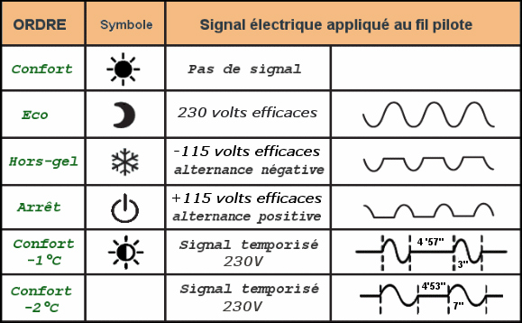
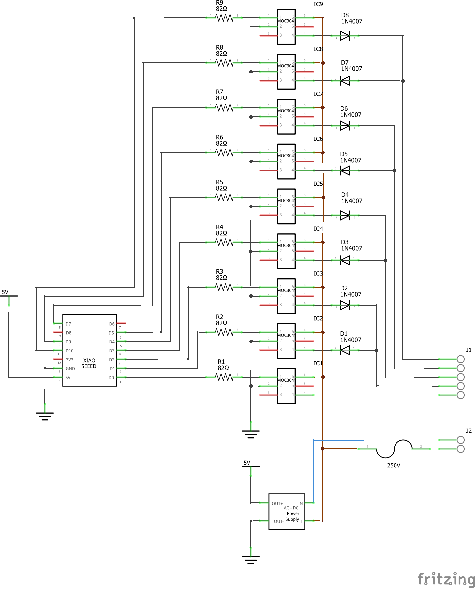
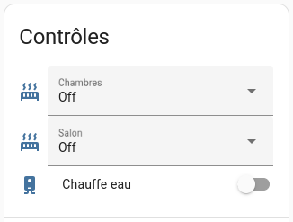

> This is based on the design of [Jérôme Labidurie (fr)](http://blog.dinask.eu/2015/09/controler-le-chauffage-par-fil-pilote.html)

Pilot wire is a widely supported technology to control electric heaters here in France. Its principle is to send a simple 230V signal on an additional wire (generally black) to set the radiator mode. Almost no current pass through this wire.

All radiators support at least four mode :

- no signal : default, also called Comfort (respects the target temperature set on the radiator)
- full signal : eco (generally 3°C bellow the target)
- negative signal : frost protection (set the target temperature to 5°C)
- positive signal : off

Higher end models also have Comfort - 1°C and Comfort - 2°C modes.



My goal is to design a simple electric circuit that will live in my electric box and allow to control my radiators from Home Assistant.

The simplest way to create these signals with a microcontroller is to use some high-voltage optocouplers and diodes, with two optocouplers we can choose to let either the negative or positive part of main voltage flow into the pilot wire.

I have four radiators in my home, this means I need 8 outputs on the MCU, I will also use an additional optocoupler to control my water heater (it will not supply the heater directly but energize the contactor in my electric box).


## Hardware

ESPHome will be installed on the Seeeduino ESP32-C3 microcontroller which as exactly 10 easily useable pins (GPIO9 being used for bootstrap).



The optocoupler I use is the MOC3041 which can switch up to 400V loads.



The input will be protected with a 82 Ohms resistor and the output is in serie with a 1N4007 diode (with alternating directions).

Other importants components are a 250V fuse and a AC-DC 5V converter to power the MCU.




## Software

In the ESPHome configuration we first need to disable the UART logger because we are using TX/RX pins as outputs.

```yaml
esp32:
  board: seeed_xiao_esp32c3
  variant: esp32c3

logger:
  baud_rate: 0
```

Then lets define the outputs, for each pilot wire we use two outputs : positive and negative.

```yaml
output:
  # pilot wire 1
  - platform: gpio
    id: fp1_positive
    pin: 3
  - platform: gpio
    id: fp1_negative
    pin: 4
  # pilot wire 2
  - platform: gpio
    id: fp2_positive
    pin: 5
  - platform: gpio
    id: fp2_negative
    pin: 6
  # etc.
```

For each pilot wire we can define a select which allows to set the wanted mode.

```yaml
select:
  # pilot wire 1
  - platform: template
    name: 'Salon'
    options:
      - 'On'
      - 'Eco'
      - 'Hors gel'
      - 'Off'
    initial_option: 'Off'
    optimistic: True
    restore_value: True
    set_action:
      then:
        - lambda: |-
            if (x == "On") {
              id(fp1_positive).turn_off();
              id(fp1_negative).turn_off();
            } else if (x == "Eco") {
              id(fp1_positive).turn_on();
              id(fp1_negative).turn_on();
            } else if (x == "Hors gel") {
              id(fp1_positive).turn_off();
              id(fp1_negative).turn_on();
            } else {
              id(fp1_positive).turn_on();
              id(fp1_negative).turn_off();
            }
```

Finally a simple switch is used to control the water heater.

```yaml
switch:
  - platform: gpio
    name: 'Chauffe eau'
    pin: 2
    restore_mode: RESTORE_DEFAULT_OFF
```

Once exposed to Home Assistant, it will lokk like this.


