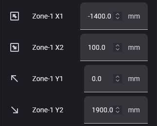
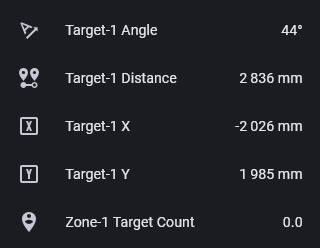

Today project is all about home automation. In want the ceiling light in my open kitchen to automatically turn on when I walk in. For that I cannot use a cheap PIR sensor as it will pick people walking by the living room, instead I need something capable of precisely locate people in the room.

## Hardware

While this seems future/expensive tech, this is in fact already possible with devices as cheap as 2-3€: the company Hi-Link produces various models of human presence radars using mmWave technology, I choosed the most expensive (5€ !), the LD2450, capable of tracking 3 people up to 6 meters.



When plugged to a micro controller it is possible to count the number of persons in range of the sensor an know their positions. With that I can know if someone is in the kitchen "zone" and turn on the light, then turn it off when the person leaves.

As always the simpliest way to connect this device to Home Assistant, is to use ESPHome as it already contains the [necessary component](https://esphome.io/components/sensor/ld2450/).

That means using an ESP micro controller, I went for the D1 mini ESP32, which is a bit overkill, a smaller ESP8266 would be largely sufficient.



To mount everything on the wall I designed this orientable case, it uses a single screw in the wall (in my case the junction box containing an AC adapter).



You can get this model [on Printables](https://www.printables.com/model/1514952-mmwave-sensor-ld2450-d1-mini-esp32).

## Software

The ESPHome documentation is very well done but here is working example with a single target and a single zone:

```yaml
esphome:
  name: kitchen-sensor
  friendly_name: kitchen-sensor

esp32:
  board: wemos_d1_mini32

wifi:
  ssid: !secret wifi_ssid
  password: !secret wifi_password

logger:

api:
  encryption:
    key: "<FILL ME>"

uart:
  id: uart_ld2450
  tx_pin: 16
  rx_pin: 17
  baud_rate: 256000
  parity: NONE
  stop_bits: 1

ld2450:
  id: ld2450_radar
  uart_id: uart_ld2450

number:
  - platform: ld2450
    ld2450_id: ld2450_radar
    zone_1:
      x1:
        name: "Zone-1 X1"
      y1:
        name: "Zone-1 Y1"
      x2:
        name: "Zone-1 X2"
      y2:
        name: "Zone-1 Y2"

sensor:
  - platform: ld2450
    ld2450_id: ld2450_radar
    target_1:
      x:
        name: "Target-1 X"
      y:
        name: "Target-1 Y"
      angle:
        name: "Target-1 Angle"
      distance:
        name: "Target-1 Distance"
    zone_1:
      target_count:
        name: "Zone-1 Target Count"
```

Once the device is added to Home Assistant you can configure the zone boundaries and see the detected positions:

 

## Automation

To ease up the creation of automations I created a binary sensor tied to the zone target count:



Now the last step is to create a automation to turn the light on and off, for that I use this awesome [Sensor Light](community.home-assistant.io/t/sensor-light-motion-sensor-door-sensor-sun-elevation-lux-value-scenes-time-light-control-device-tracker-night-lights/481048/1) blueprint, it even allows to only turn the light on at night using my external illuminance sensor.

---

Here is the final product mounted on the wall:


